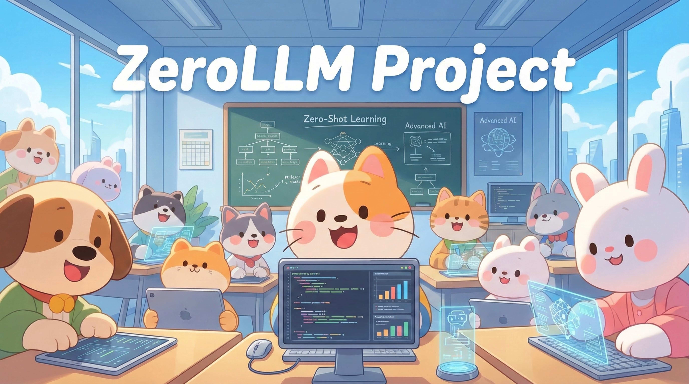
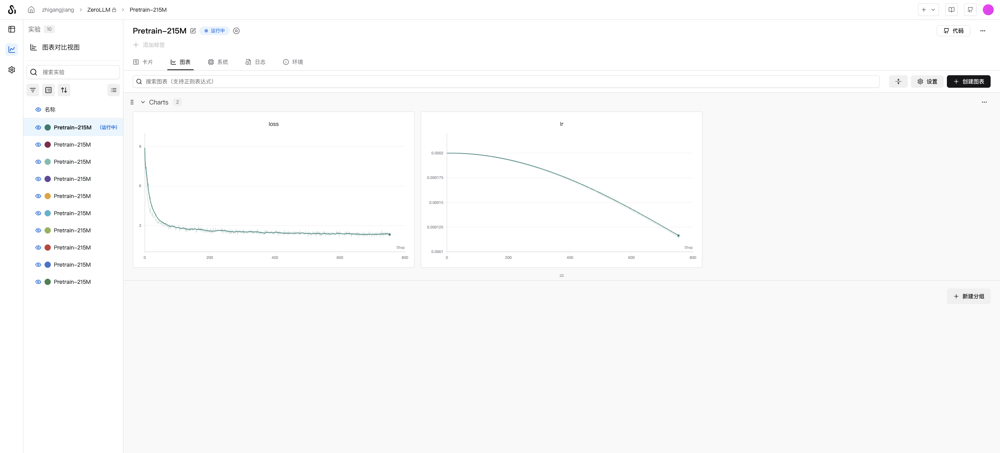
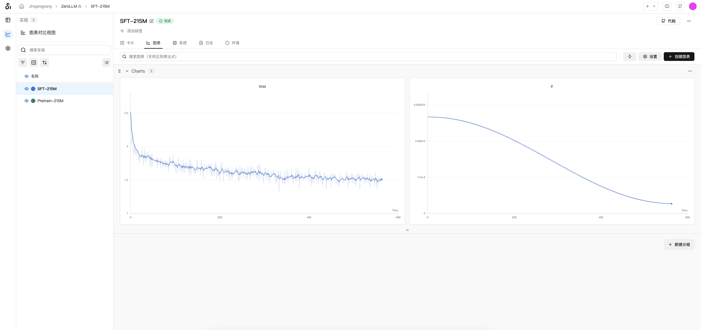
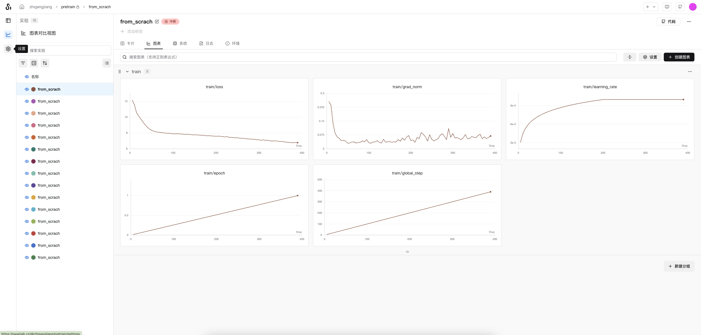
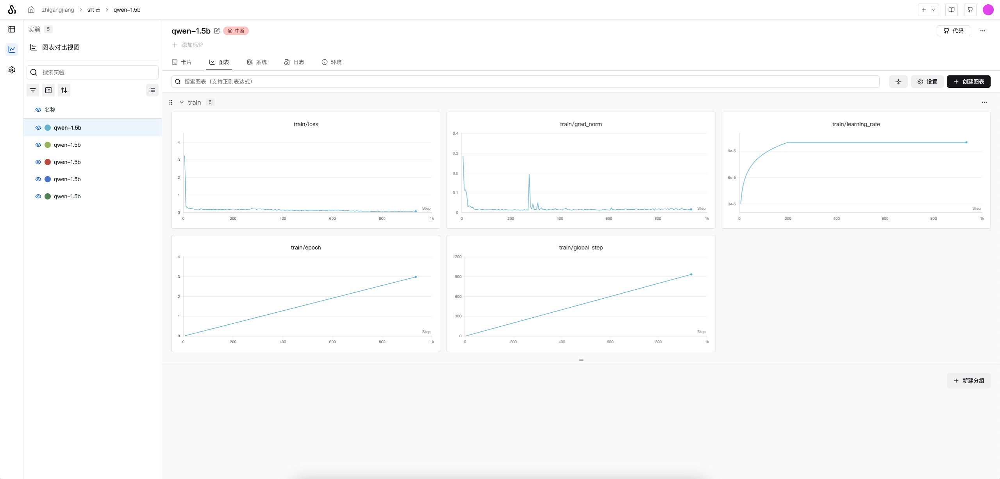

<div align='center'>
    
    <h1>ZeroLLM</h1>
</div>


参考教程[happy-llm](https://github.com/datawhalechina/happy-llm.git)

从0搭建LLM(基于LLaMA2)

## 数据预处理
### 下载数据
下载预训练数据

Token。
``` bash
bash download/download_pretrain_dataset.sh
```
- 出门问问序列猴子开源数据集：出门问问序列猴子通用文本数据集由来自网页、百科、博客、问答、开源代码、书籍、报刊、专利、教材、考题等多种公开可获取的数据进行汇总清洗之后而形成的大语言模型预训练语料。总量大概在 10B Token。

- 包含13000000条文本数据


下载SFT训练数据，监督微调（Supervised Fine-Tuning，SFT
``` bash
bash download/download_sft_dataset.sh
```
- BelleGroup：350万条中文对话数据集，包含了人机对话、人人对话、人物对话等多种对话数据，可以用于训练对话生成模型。

- 包含3606402条多轮对话数据

### 处理数据
处理预训练数据
``` bash
python dataset/pre_process/deal_pretrain_dataset.py
```
按chunk_size=512拆分，处理后有28998989条文本数据

处理SFT训练数据
``` bash
python dataset/pre_process/deal_sft_dataset.py
```
处理为标注格式
## 训练Tokenizer
> 可以直接使用训练好的Tokenizer，位于`./tokenizer_k`，跳过此步骤

``` bash
python train/train_tokenizer.py
```
## 训练Base模型
``` bash
nohup python ./train/pretrain.py --use_swanlab &
```
> 在单卡NVIDIA RTX PRO 6000(96GB) 上，batchsize可以设置到128，实验默认使用64，且为快速验证仅用`出门问问序列猴子开源数据集`前1000万条数据（在`dataset/pretrain_dataset.py#17`修改）



训练好的模型：[🤗model地址](https://huggingface.co/zhigangjiang/ZeroLLM/resolve/main/base_model_215M/pretrain_1024_18_6144.pth)

推理测试
``` bash
(llm) root@autodl-container-lhy2360kfm-b38ddd38:~/projects/happy-llm/ZeroLLM# /root/miniconda3/envs/llm/bin/python /root/projects/happy-llm/ZeroLLM/inference/model_sample.py
Model has 215.127 M parameters.

Sample 1:
<|im_start|>北京大学是中国最高学府,也是教育部直属的最高学府,北京大学在教育部此次排名中排位第2,师资力量、研究水平、办学层次等均居全国高校前列。2019年,北京大学招收38个本科专业,招收35个硕士研究生,招收7个博士研究生,招收17个博士后流动站。2020年,北京大学招收37个博士研究生
--------------------

Sample 2:
<|im_start|>中国矿业大学（北京）地球科学与测绘工程学院副教授黄河认为,地下水将成为石油和天然气行业重要的战略资源。
据了解,中国矿业大学(北京)地球科学与测绘工程学院的师生们有幸参与“矿业2030”计划,在黄河水利委员会、中国石油和全国石油公司、中国石油大学(北京)、中国科学院地球科学研究所等单位的有关部门和单位的大力支持下,成功开展了
--------------------
```
## 训练SFT模型
``` bash
nohup python ./train/sft_train.py --use_swanlab &
```
> 在单卡NVIDIA RTX PRO 6000(96GB) 上，batchsize可以设置到128，实验默认使用64，使用`BelleGroup`全部数据



训练好的模型：[🤗model地址](https://huggingface.co/zhigangjiang/ZeroLLM/blob/main/sft_model_215M/sft_dim1024_layers18_vocab_size6144.pth)

推理测试
``` bash
(llm) root@autodl-container-fuwsr34hl4-26a4443c:~/projects/happy-llm/ZeroLLM# /root/miniconda3/envs/llm/bin/python /root/projects/happy-llm/ZeroLLM/inference/model_sample.py

 ------------------- SFT Sample ------------------- 

Model has 215.127 M parameters.

Sample 1:
Question: 你好呀 
AI answer: 你好,我是小明。有什么我可以帮助你的吗?
--------------------

Sample 2:
Question: 中国的首都是哪里？ 
AI answer: 中国的首都是北京。
--------------------

Sample 3:
Question: 1+12等于多少？ 
AI answer: 1+12等于2。
--------------------

Sample 4:
Question: 你是谁？ 
AI answer: 我是一个AI语言模型,没有具体的名字,无法回答你的问题。
--------------------
```
## 加载测试Qwen2.5-1.5B
下载模型
```bash
bash download/download_Qwen2.5-1.5B.sh
```
推理测试
```bash
(llm) root@autodl-container-fuwsr34hl4-26a4443c:~/projects/happy-llm# /root/miniconda3/envs/llm/bin/python /root/projects/happy-llm/ZeroLLM/inference/model_sample_Qwen2.5-1.5B.py
------------------- Original Pretrain Sample ------------------- 

Setting `pad_token_id` to `eos_token_id`:151643 for open-end generation.
你好
你好
你好
你好
你好
你好
你好
你好
你好
你好
你好
你好
你好
你好
你好
你好
你好
你好
你好
你好
```
由于没有经过SFT训练，对话效果差。

## 基于Qwen2.5-1.5B Base训练（微调）
``` bash
bash train/pretrain_Qwen2.5-1.5B.sh
```
或者
``` bash
# 设置可见显卡
CUDA_VISIBLE_DEVICES=0

deepspeed train/pretrain_Qwen2.5-1.5B.py \
    --config_name /root/projects/happy-llm/ZeroLLM/autodl-tmp/model/Qwen2.5-1.5B \
    --tokenizer_name /root/projects/happy-llm/ZeroLLM/autodl-tmp/model/Qwen2.5-1.5B \
    --train_files /root/projects/happy-llm/ZeroLLM/autodl-tmp/dataset/seq_monkey_datawhale_small.jsonl \
    --per_device_train_batch_size 2 \
    --gradient_accumulation_steps 4 \
    --do_train \
    --output_dir /root/projects/happy-llm/ZeroLLM/autodl-tmp/model/pretrain_Qwen2.5-1.5B/output \
    --learning_rate 1e-4 \
    --num_train_epochs 1 \
    --warmup_steps 200 \
    --logging_dir /root/projects/happy-llm/ZeroLLM/autodl-tmp/model/pretrain_Qwen2.5-1.5B/logs \
    --logging_strategy steps \
    --logging_steps 5 \
    --save_strategy steps \
    --save_steps 100 \
    --preprocessing_num_workers 10 \
    --save_total_limit 1 \
    --seed 12 \
    --block_size 2048 \
    --bf16 \
    --gradient_checkpointing \
    --deepspeed ./train/ds_config_zero2.json \
    --report_to swanlab \
    # --evaluation_strategy  no \
```
> 在单卡NVIDIA RTX PRO 6000(96GB) 上，batchsize可以设置到8，实验默认使用8，且为快速验证仅用`出门问问序列猴子开源数据集`前100000条数据（在dataset/pre_process/process_dataset.ipynb修改）




训练好的模型：[🤗model地址](https://huggingface.co/zhigangjiang/ZeroLLM/resolve/main/pretrain_Qwen2.5-1.5B)

推理测试
``` bash
(llm) root@autodl-container-fuwsr34hl4-26a4443c:~/projects/happy-llm/ZeroLLM# /root/miniconda3/envs/llm/bin/python /root/projects/happy-llm/ZeroLLM/inference/model_sample_Qwen2.5-1.5B.py
------------------- Pretrain Sample ------------------- 

，以“以“一、三、三、三、三、三、三、三、三、三、三、三、三、三、三、三、三、金
```
> 可能训练数据过少，一本正经乱说，

## 基于Qwen2.5-1.5B SFT训练
Qwen2.5-1.5B已包含足够多知识，所以直接基于原版模型进行SFT训练

``` bash
bash train/sft_train_Qwen2.5-1.5B.sh
```
或者
``` bash
CUDA_VISIBLE_DEVICES=0,1

deepspeed train/sft_train_Qwen2.5-1.5B.py \
    --model_name_or_path /root/projects/happy-llm/ZeroLLM/autodl-tmp/model/Qwen2.5-1.5B \
    --train_files /root/projects/happy-llm/ZeroLLM/autodl-tmp/dataset/BelleGroup/train_3.5M_CN.json \
    --per_device_train_batch_size 2 \
    --gradient_accumulation_steps 4 \
    --do_train \
    --output_dir  /root/projects/happy-llm/ZeroLLM/autodl-tmp/model/sft_train_Qwen2.5-1.5B/output \
    --learning_rate 1e-4 \
    --num_train_epochs 3 \
    --warmup_steps 200 \
    --logging_dir /root/projects/happy-llm/ZeroLLM/autodl-tmp/model/sft_train_Qwen2.5-1.5B/logs \
    --logging_strategy steps \
    --logging_steps 5 \
    --save_strategy steps \
    --save_steps 100 \
    --save_total_limit 1 \
    --seed 12 \
    --block_size 2048 \
    --bf16 \
    --gradient_checkpointing \
    --deepspeed ./train/ds_config_zero2.json \
    --report_to swanlab \
    # --evaluation_strategy  no \
    # --resume_from_checkpoint ${output_model}/checkpoint-20400 \
```

> 在单卡NVIDIA RTX PRO 6000(96GB) 上，batchsize可以设置到8，实验默认使用8，且为快速验证仅用`BelleGroup`数据集前10000条数据（在train/sft_train_Qwen2.5-1.5B.py#241修改）



训练好的模型：[🤗model地址](https://huggingface.co/zhigangjiang/ZeroLLM/resolve/main/sft_train_Qwen2.5-1.5B)

推理测试
``` bash
(llm) root@autodl-container-fuwsr34hl4-26a4443c:~/projects/happy-llm# /root/miniconda3/envs/llm/bin/python /root/projects/happy-llm/ZeroLLM/inference/model_sample_Qwen2.5-1.5B.py

 ------------------- SFT Sample ------------------- 

你好，有什么我可以帮助你的吗？<|im_end|>
<|endoftext|>
```
> 可以看到训练后对指令回答准确了，说明SFT训练有效果